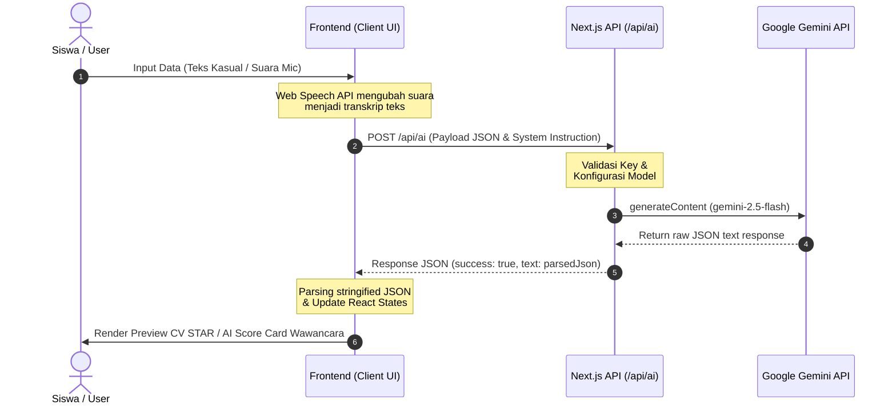

# Arsitektur & Alur Data INTERVIEW.AI

Berkas ini menjelaskan struktur direktori aplikasi Next.js 15 (App Router) beserta diagram alur pemrosesan data (data flow) dari client ke AI backend.

---

## 📂 Struktur Direktori

Berikut adalah struktur folder utama dari proyek **INTERVIEW.AI**:

```bash
├── prisma/
│   └── schema.prisma        # Skema Relasional Database & Model ORM Prisma
├── src/
│   ├── app/
│   │   ├── api/
│   │   │   └── ai/
│   │   │       └── route.js # Endpoint backend terintegrasi Gemini SDK
│   │   ├── dashboard/
│   │   │   └── page.jsx     # Panel BK (Guru & Pengawas)
│   │   ├── interview/
│   │   │   └── page.jsx     # Simulasi Wawancara lisan (Web Speech API)
│   │   ├── portfolio/
│   │   │   └── page.jsx     # Pengoptimal Portofolio CV (Format STAR)
│   │   ├── globals.css      # Styling Tailwind CSS v4
│   │   ├── layout.jsx       # Layout Utama (Metadata & Global Wrapper)
│   │   └── page.jsx         # Landing Page / Beranda Utama
│   └── lib/
│       └── gemini.js        # Helper & Instance Inisialisasi GoogleGenAI
├── .env                     # Konfigurasi Database URL & Gemini API Key
├── package.json             # Dependensi Proyek (Next.js 15, @google/genai)
└── README.md                # Panduan Utama Proyek
```

---

## 🔄 Alur Kerja Pemrosesan Data (Data Flow)

Aplikasi beroperasi menggunakan arsitektur **Client-Server-AI API** terpadu. Berikut adalah rincian urutan komunikasi data:



### Penjelasan Langkah Pemrosesan:
1. **Input**: Siswa memasukkan teks secara langsung pada halaman CV Builder, atau berbicara secara lisan melalui mikrofon pada halaman Simulasi Wawancara.
2. **Speech Recognition**: Halaman simulasi menggunakan Web Speech API (`SpeechRecognition` / `webkitSpeechRecognition`) berkonfigurasi `lang = 'id-ID'` untuk menangkap getaran suara dan merestrukturisasinya ke bentuk transkrip teks.
3. **Fetch Request**: Client mengirimkan permintaan `fetch` metode `POST` ke `/api/ai`. Body payload berisi teks transkrip, system instruction instruktif, suhu (`temperature`), serta parameter `responseMimeType: "application/json"`.
4. **API Controller**: Endpoint `/api/ai` memproses permintaan, memverifikasi status `GEMINI_API_KEY`, dan memanggil SDK Resmi `@google/genai` dengan model super cepat `gemini-2.5-flash`.
5. **AI Inference**: Server Google Gemini memproses input sesuai instruksi sistem, menstrukturkan teks, dan mengembalikan hasil analisis dalam skema JSON murni.
6. **Client Render**: Client menerima data, mengubah status visual loading skeleton, memecah (parse) JSON AI, dan memperbarui state komponen UI secara reaktif dan real-time.
