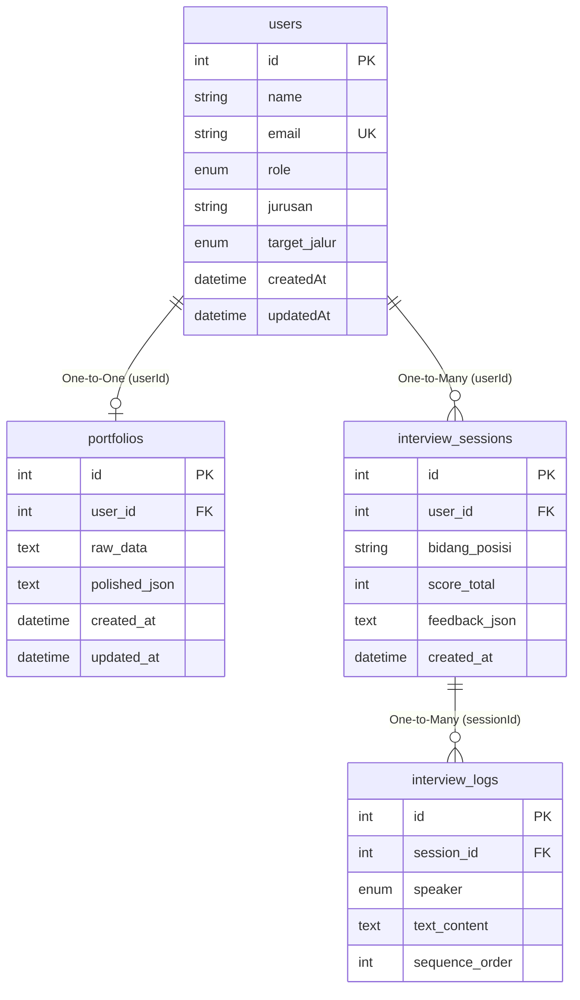

# Spesifikasi Skema Database INTERVIEW.AI

Berkas ini mendokumentasikan skema database relasional MySQL yang dikonfigurasi melalui **Prisma ORM** di file `prisma/schema.prisma`.

---

## 🗺️ Skema Relasi Database (ERD)

---

## 🗄️ Spesifikasi Tabel

### 1. Tabel `users`
Tabel ini digunakan untuk mengelola data akun siswa dan guru pengawas.

| Nama Kolom | Tipe Data | Nullable | Keterangan / Default |
| :--- | :--- | :---: | :--- |
| `id` | `Int` | Tidak | Primary Key, Autoincrement. |
| `name` | `String` | Tidak | Nama Lengkap pengguna. |
| `email` | `String` | Tidak | Alamat email unik (`@unique`). |
| `role` | `Enum (UserRole)` | Tidak | Peran pengguna. Default: `siswa` (opsi: `siswa`, `guru_bk`). |
| `jurusan` | `String` | Ya | Kompetensi keahlian/jurusan (khusus siswa). |
| `target_jalur`| `Enum (TargetJalur)` | Tidak | Rencana lulusan. Default: `kerja_smk` (opsi: `kerja_smk`, `kuliah_snbt`). |
| `createdAt` | `DateTime` | Tidak | Waktu pembuatan akun. Default: `now()`. |
| `updatedAt` | `DateTime` | Tidak | Waktu pembaruan akun. |

### 2. Tabel `portfolios`
Tabel ini menyimpan data CV harian siswa yang belum dipoles serta hasil optimasi berbasis standar metode STAR AI.

| Nama Kolom | Tipe Data | Nullable | Keterangan / Default |
| :--- | :--- | :---: | :--- |
| `id` | `Int` | Tidak | Primary Key, Autoincrement. |
| `user_id` | `Int` | Tidak | Foreign Key ke `users(id)`, Unique (`@unique`). |
| `raw_data` | `Text` | Tidak | Pengalaman kerja kasual/harian mentah dari siswa. |
| `polished_json`| `Text` | Ya | Output terstruktur hasil polesan AI berformat JSON. |
| `created_at` | `DateTime` | Tidak | Waktu pencatatan. Default: `now()`. |
| `updated_at` | `DateTime` | Tidak | Waktu pembaruan portofolio. |

**Relasi**: `1-to-1` dengan `users` (`onDelete: Cascade`).

### 3. Tabel `interview_sessions`
Tabel ini mencatat sesi utama simulasi wawancara yang diselesaikan siswa.

| Nama Kolom | Tipe Data | Nullable | Keterangan / Default |
| :--- | :--- | :---: | :--- |
| `id` | `Int` | Tidak | Primary Key, Autoincrement. |
| `user_id` | `Int` | Tidak | Foreign Key ke `users(id)`. |
| `bidang_posisi`| `String` | Tidak | Bidang karir/posisi yang diuji. |
| `score_total` | `Int` | Ya | Skor kumulatif (skala 1-100) dari hasil evaluasi AI. |
| `feedback_json`| `Text` | Ya | Catatan detail kekuatan & saran perbaikan berformat JSON. |
| `created_at` | `DateTime` | Tidak | Waktu sesi. Default: `now()`. |

**Relasi**: `Many-to-One` dengan `users` (`onDelete: Cascade`).

### 4. Tabel `interview_logs`
Tabel ini menyimpan transkrip rekaman suara percakapan tanya-jawab secara detail per urutan kalimat.

| Nama Kolom | Tipe Data | Nullable | Keterangan / Default |
| :--- | :--- | :---: | :--- |
| `id` | `Int` | Tidak | Primary Key, Autoincrement. |
| `session_id` | `Int` | Tidak | Foreign Key ke `interview_sessions(id)`. |
| `speaker` | `Enum (Speaker)` | Tidak | Pembicara kalimat. (opsi: `ai`, `siswa`). |
| `text_content` | `Text` | Tidak | Isi teks kalimat pertanyaan pewawancara atau jawaban siswa. |
| `sequence_order`| `Int` | Tidak | Nomor urut pembicaraan. |

**Relasi**: `Many-to-One` dengan `interview_sessions` (`onDelete: Cascade`).
